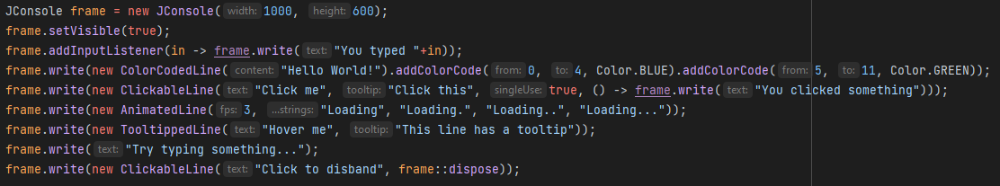

About
-----
This is a console-like interface implemented in swing. Java so far is lacking something like this, the only way to achieve something similar is to 
run the program from the command line and use the OS's terminal. However, this is far from a stand alone terminal window to handle very simple
user IO that does not require a fancy GUI.
Features include...
* undecorated window that can be dragged around and be scrolled up and down
* writing to the console and binding functionality such as click events and tooltips to messages
* set a default text color as well as color code individual messages
* get user input from the console
* a utility class to easily get keyboard key states without having to implement a listener

Building
--------
This is a gradle project, clone the repository and build gradle. Then run the 'build' task, your jar can be found in 'build/libs'

How to use
----------
The following example is also found within the jar in the 'example' package and can be ran for demonstration.



To use this library's functionality, create a JConsole object by passing width and height to the constructor. This class extends JFrame so you
may incorporate it into other existing code however you may need. It also fully supports all other swing functionality.
To write to the consoler use the ```Console#write(...)``` method. This method can either take a plain String or a special implementation of the
ConsoleLine class that can provide special functionality. Refer to the example for these.

You can add input listeners (input being strings typed in by the user) to the console. A console input listener is simply a ```Consumer<String>```
so they can be nicely passed in as lambda expressions. There are two ways to register an input listener:
* a permanent listener will always be called on any input
* singular listeners will be applied to the next input and then cleared
<br>Use the methods ```addInputListener(...) ``` and  ```addSingleTimeListener(...) ``` respectively.

You may also set the default text color using  ```setDefaultTextColor(...) ```.

Enhancing functionality
-----------------------
To extend the functionality provided you can implement your own special type of Console Line with additional Functionality.

To do so, extend 'de.leftclicka.jconsole.internal.lines.ConsoleLine'. You can also extends the other implementations found in the
package to inherit functionalities such as being clickable or having a tooltip when hovered with the mouse.

Override the methods ```getDefaultText()``` and ```getHoveredText()``` to add function to your own line implementation. If this should
not be enough for whatever you want to achieve, you can register a special renderer for your type of console line with the console object
you are using. To do this, call ```JConsole#addSpecialRenderer()``` and pass in your line implementation's class object as well as your
own implementation of the ```ConsoleLineRenderer``` interface. Override ```void render(ConsoleLine line, int yLevel, boolean isHovered, Color defaultColor, Graphics2D graphics)```
with your own rendering code. You can always assume that the first parameter's runtime class will be the same class that you registered your
special renderer with.

Technically, this usage of the graphics object could allow you to draw on the entirety of the console window. While it
is generally only recommended to draw at the yLevel passed to your method call, you can definetely get hacky if you feel like it
and know what you are doing.
